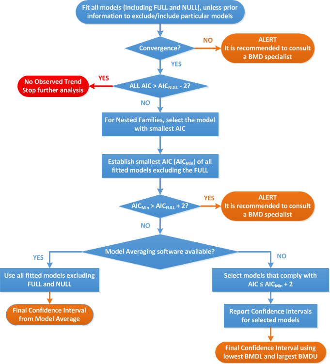

<!-- Table of contents in rmarkdown:http://stackoverflow.com/questions/11948245/markdown-to-create-pages-and-table-of-contents -->

```{r knitr, echo=FALSE, results='hide'}
knitr::opts_chunk$set(echo = FALSE, results = 'asis', warning = FALSE, message = FALSE)

library(png)
library(grid)
```


```{r auxFunctions}
library(knitr)
allFactors <- c(input$fct1.no, input$fct2.no, input$fct3.no, 
    input$fct4.no, input$fct5.no, input$factors)
allFactors <- unique(allFactors[allFactors != "0"])

rawData <- results$dataModified()$data
reverseFactors <- sort(as.numeric(allFactors), decreasing = TRUE) 


if(nrow(rawData) > 20){
  
  summarizedData <- TRUE
  colForGroups <- as.numeric(c(input$xans, allFactors, input$nest.no))
  xNames <- paste(names(rawData)[colForGroups], collapse = " + ")
  # Take the average or the sum, depending on dtype
  yNames <- paste("cbind(", paste(names(rawData)[
              unique(c(as.numeric(input$Vyans), results$shinyInput()$Vnans))], collapse = ", "), ")")
  
  summaryData <- aggregate(formula = as.formula(paste(yNames, "~", xNames)),
      data = rawData, FUN = if (results$dtype() %in% c(4, 6, 10)) sum else mean, na.action = na.omit)
  
  dataTables <- summaryData[, names(rawData)[unique(as.numeric(c(input$xans, results$shinyInput()$Vyans,
                      results$shinyInput()$Vnans, input$nest.no, allFactors)))]] 
  
} else {
  
  summaryData <- rawData
  summarizedData <- FALSE
  
  if(length(reverseFactors) == 0)
    orderedData <- summaryData[order(summaryData[,names(summaryData)[as.numeric(results$shinyInput()$xans)]]), ] else
    orderedData <- summaryData[order(interaction(summaryData[,reverseFactors]), 
            summaryData[,as.numeric(results$shinyInput()$xans)]), ]
  
  dataTables <- orderedData[, unique(as.numeric(c(input$xans, results$shinyInput()$Vyans,
                  results$shinyInput()$Vnans, input$sans, input$nest.no, allFactors)))]
  
}
```

# Data description

```{r describeData}
if(length(results$selectedResponses()) == 1)
  cat("The endpoint to be analyzed is: ", 
      names(results$selectedResponses()), ". \n", sep = "") else 
  cat("The endpoints to be analyzed are: ", 
      paste(names(results$selectedResponses()), collapse = ", "), ". \n", sep = "")

if(input$subsetVariable != "none")
  cat("Subset of the data is taken according to ", 
      names(results$varnamesChoices())[as.numeric(input$subsetVariable)], 
      ", retaining values ", input$levelSubset, ". \n", sep = "")

rowsMissing <- nrow(results$dataLoaded()$data) - nrow(results$dataModified()$data)

if(rowsMissing > 0)
  cat("There are", rowsMissing, "rows with missing values removed from the data.")

if (!summarizedData)
  cat("\n Data used for analysis: \n \n ") else
  cat("\n Summary of data used for analysis: \n \n ") 
print(kable(dataTables))
cat("\n \n")


textShowData <- "## Response variable: %s
    
    "
if(length(results$selectedResponses()) > 1){
  for(iResponse in seq_along(results$selectedResponses()))
    cat(sprintf(textShowData, names(results$selectedResponses())[iResponse]), 
        "\n *Information pertaining to this endpoint.* \n \n \n")
} else cat("\n *Information pertaining to this endpoint.* \n \n \n")
```

# Selection of the BMR

The BMD (benchmark dose) is defined as the dose that corresponds with 
```{r specifyBmr}
if (input$dtype  %in% c('2', '4')){
  switch(input$ces.ans, 
      '1' = cat("an estimated risk of 50%. "),
      '2' = cat(paste0("an additional risk of ", input$CES*100, "% compared with the background risk. ")),
      '3' = cat(paste0("an extra risk of ", input$CES*100, "% compared with the background risk. "))
  )
  cat("The BMR (benchmark response) is the estimated risk corresponding with the BMD of interest.")
} else {
  cat(paste0("a ", input$CES*100, "% estimated difference in response compared with the background response. ")) 
  cat("The BMR (benchmark response) is the estimated response corresponding with the BMD of interest.")
}

cat("\n\n *The rationale behind the choice made should be described.*")
```

A `r input$conf.lev * 100`% confidence interval around the BMD will be
estimated, the lower bound is reported by BMDL and the upper bound by BMDU.

```{r factors}
if(!is.null(input$fct2.no))
  if(input$fct2.no != "0")
    cat("For each level of the factor", names(results$varnamesChoices())[as.numeric(input$fct2.no)],
        "a separate estimate for the BMD, BMDL and BMDU will be reported.")
```


# Software used

Results are obtained using the R-package "bmdModeling".

* Fitting benchmark dose models is based on the R-package
  [proast61.3](http://www.rivm.nl/en/Documents_and_publications/Scientific/Models/PROAST).
* Averaging results from multiple fitted benchmark dose models is based on the
  methodology in [Wheeler and Bailer
  (2008)](https://www.jstatsoft.org/article/view/v026i05).


# Specification of deviations from default assumptions

**General assumptions**

*Please motivate in detail assumptions made when deviating from the recommended
defaults (e.g. gamma distributional assumption instead of log-normal,
heteroscedasticity instead of homoscedasticity).* 


```{r modelAveraging}
allTypes <- c("continuous" = 1, "binary" = 2, "ordinal" = 3, "quantal" = 4, 
    "continuous, clustered" = 5, "quantal, clustered" = 6,
    "continuous, summary data" = 10)

if (!is.null(input$performMA)) {
  
  if (results$dtype() %in% c(2, 4) & !input$performMA) {
    
    cat("**Model averaging** \n\n", 
        "*Model averaging software is available but not used: provide rationale for deviating from the recommended approach.*")
    
  }
  
}
```

**Dose-response model sets**

*Other models than the recommended ones that were fitted should be listed, with
the respective description of reasons to include them.*

```{r listModels}
allModels <- getModelNames(dtype = as.numeric(input$dtype))

if(input$singleModel == "yes"){
  
  cat("The dose-response model that is being fit, is", 
      names(allModels)[as.numeric(input$selectedModel)])
  
} else {
  
  cat("Default set of fitted models: \n \n")
  
  if (input$dtype == '1') {
    
    cat("|Model| Number of parameters | Formula | \n",
        "|:-----------------|:------------:|:--------------------------------| \n",
        "| Null | 1 | $y = a$ | \n",
        "| Full | no. of groups | $y = \\text{group mean}$ | \n",
        "| Exp model 3 | 3 | $y = a \\cdot \\exp(b x^d)$ | \n",
        "| Exp model 5 | 4 | $y = a \\cdot (c - (c-1) \\exp(-bx^d))$ | \n",
        "| Hill model 3 | 3 | $y = a \\cdot \\left(1 - \\frac{x^d}{b^d + x^d} \\right)$ | \n",
        "| Hill model 5 | 4 | $y = a \\cdot \\left(1 + (c-1) \\frac{x^d}{b^d + x^d} \\right)$
            |")
    
  } else if (input$dtype == '3'){
    
    cat("|Model| Number of parameters | Formula | \n",
        "|:-----------------|:------------:|:--------------------------------| \n",
        "| Null | 1 | $y = a$ | \n",
        "| Exp model 4 | 4 | $y = y = a \\cdot (c - (c-1) \\exp(-bx) )$ | \n",
        "| Exp model 3 | 3 | $y = a \\cdot \\exp(b x^d)$ | \n",
        "| Exp model 5 | 4 | $y = a \\cdot (c - (c-1) \\exp(-bx^d))$ | \n",
        "| Hill model 3 | 3 | $y = a \\cdot \\left(1 - \\frac{x^d}{b^d + x^d} \\right)$ | \n",
        "| Hill model 5 | 4 | $y = a \\cdot \\left(1 + (c-1) \\frac{x^d}{b^d + x^d} \\right)$
            |")
    
  } else {
    
    cat("|Model| Number of parameters | Formula | \n", 
        "|:-----------------|:------------:|:--------------------------------| \n",
        "| Null | 1 | $y = a$ | \n",
        "| Full | no. of groups | $y = \\text{group mean}$ | \n", 
        "| Logistic | 2 | $y = \\frac{1}{1 + \\exp(-a - bx)}$ | \n",
        "| Probit | 2 | $y = pnorm((x - a) \\cdot b)$ | \n",
        "| Log-logistic | 3 | $y = a + \\frac{1 - a}{1 + \\exp \\left( c \\cdot \\log \\left( \\frac{b}{x} \\right) \\right)}$| \n",
        "| Log-probit | 3 | $y = a + (1 - a) \\cdot pnorm \\left(c \\cdot \\log \\left( \\frac{x}{b} \\right) \\right)$ | \n",
        "| Weibull | 3 | $y = a + (1 - a) \\left(1 - \\exp \\left( - \\left( \\frac{x}{b} \\right)^c \\right) \\right)$ | \n", 
        "| Gamma | 3 | $y = pgamma(bx; c)$ | \n", 
        "| Two-stage | 3 | $y = a + (1 - a) \\left( 1 - \\exp \\left(- \\frac{x}{b} - c \\left( \\frac{x}{b} \\right)^2 \\right) \\right)$ | \n")
    
    
  }
}
```

```{r includedFactors}
factorsText <- sapply(results$allParameters(), function(iParameter) {
      
      if (results$shinyInput()[[paste0("fct", iParameter, ".no")]] != 0) {
        
        parameterName <- names(results$allParameters())[which(iParameter == results$allParameters())]
        covariateNames <- paste(names(results$varnamesChoices())[
                as.numeric(results$shinyInput()[[paste0("fct", iParameter, ".no")]])], collapse = ", ")
        
        paste0(parameterName, ": ", covariateNames)
        
      } else NA
      
    })

if(!all(is.na(factorsText)))
  cat("A covariate is included with respect to", 
      paste0(paste(factorsText[!is.na(factorsText)], collapse = "; "), "."),
      "Therefore the number of parameters in each model might be larger than indicated in the table above.")
```

**Procedure for selection of BMDL**

*Description of any deviation from the procedure described in the flow chart to
obtain the final BMD confidence interval (e.g. using AIC - 5 instead of AIC - 2
for model selection).*




# Results

``` {r resultsFittedModels}
textFittedModels <- "## Response variable: %s
    "

if (input$submit == 0) {
  
  cat("No results available: Please fit models in the application.") 
  
} else {
  
  reportedErrors <- lapply(results$fittedModels(), function(fittedModelsResponse) {
        
        if (input$singleModel == "no") {
          
          errorModels <- sapply(fittedModelsResponse, function(iModel){
                if (is(iModel, "error"))
                  iModel$message else 
                  NULL
                
              })     
          
          if (!all(sapply(errorModels, is.null)))
            return(paste("Error(s) in calculation:", 
                    paste(unique(errorModels[!is.null(errorModels)]), collapse = ", "))) else 
            return(NULL)
          
        } else {
          
          if (is(fittedModelsResponse, "error"))
            return(paste("Error(s) in calculation: \n", 
                    fittedModelsResponse$message)) else
            return(NULL)
          
        }
        
      })
  
  
  for (iResponse in seq_along(results$selectedResponses())) {
    
    summaryResult <- results$summaryTables()[[iResponse]]
    
    if (input$allCovariates) {
      
      tmpTable <- summaryResult$summaryTable
      
    } else {
      
      tmpTable <- filterBestCovariates(summaryResult$summaryTable)
      
    }
    
    extraInfo <- summaryResult$extraInfo
    colnames(tmpTable) <- attr(tmpTable, "columnNames")
    
    if (all(nchar(tmpTable[, "Included covariate(s)"]) < 1)) {
      
      tmpTable <- tmpTable[, names(tmpTable) != "Included covariate(s)"]
      cat("None of the models had a better fit when including the covariate(s) \n\n") 
      
    }
    
    if (!is.null(extraInfo$aicWarning))
      cat("Please consult a BMD specialist:", extraInfo$aicWarning, "\n \n")
    
    if (input$singleModel == "no") {
      
      bestModel <- apply(extraInfo$bestModel, 1, function(x){
            if (x["parameterNames"] == "") 
              x["model"] else
              paste(x, collapse = " with covariate for ") 
          })
      
      bestModelIndex <- extraInfo$bestModelIndex
      
      if (length(results$selectedResponses()) > 1)
        cat(sprintf(textFittedModels, names(results$selectedResponses())[iResponse]))
      
      cat("<!-- begin-landscape -->")
      cat("Table with summary of the fitted models")
      
      print(kable(tmpTable, digits = 2))
      cat("\n\n")
      
      if (!is.null(results$warningText()[[iResponse]]) | 
          !is.null(reportedErrors[[iResponse]])) {
        
        cat("Alerts that were indicated when fitting the models: \n")
        cat(results$warningText()[[iResponse]], "\n")
        cat(paste(reportedErrors[[iResponse]], collapse = "\n"), "\n \n")
        
      }
      
      stopAnalysis <- FALSE
      if (!is.null(extraInfo$aicWarning))
        if (grepl("null model", extraInfo$aicWarning))
          stopAnalysis <- TRUE
      
      
      if (stopAnalysis) {
        
        cat("\n\n")
        cat("<!-- end-landscape -->")
        
        f.plot.all(results$fittedModels()[[iResponse]][[2]])
        cat("\n \n")
        
      } else if (is.null(results$averagedModels())) {
        
        cat("The lowest BMDL(s):", paste(extraInfo$minBmdl, collapse = ", "), "\n \n")
        cat("The highest BMDU(s):", paste(extraInfo$maxBmdu, collapse = ", "), "\n \n")
        cat("The best model(s): ", paste(bestModel, collapse = ", "), "\n \n")
        
        cat("\n\n")
        cat("<!-- end-landscape -->")
        
        for (iBest in seq_along(bestModelIndex)) {
          f.plot.all(results$fittedModels()[[iResponse]][[bestModelIndex[iBest]]])
          cat("\n \n")
        }
        
        cat("No results for model averaging.") 
        
      } else {
        
        bmdTables <- results$averagedModels()[[iResponse]]$bmdTable
        weightsTable <- results$averagedModels()[[iResponse]]$weights
        
        # Included not equal to accepted models
        if (input$advancedMA %% 2 == 1)
          cat("\n Warning: The user selected a set of models for model averaging which might deviate from the default set (converged models). \n",
              "Selected models:", 
              paste(names(allModels)[allModels %in% as.numeric(input[[paste0("modelsMA", iResponse)]])], collapse = ", "), "\n\n")
        
        cat("\n \n")
        print(kable(weightsTable, digits = 2))
        cat("\n \n")
        
        cat("Given", input$nBootstraps, "generated data sets, the BMDL is the", 
            paste0((1 - input$conf.lev)/2*100, "th"), "percentile of all parametric bootstrap BMD values and the BMDU is the",
            paste0((1 - (1 - input$conf.lev)/2)*100, "th"), "percentile. \n\n")
        
        if (input$doNaiveApproach) {
          
          cat("**Approach 1** Estimated the BMD as a weighted average of the accepted models' BMD values.\n\n")
          
          print(kable(bmdTables[[1]], digits = 2)) 
          cat("\n \n")
          
          cat("**Approach 2** Estimated the BMD based on the averaged response model which is a weighted average of the accepted models' response values. \n\n")
          
          print(kable(bmdTables[[2]], digits = 2)) 
          cat("\n\n")
          
        } else {
          
          cat("Estimated the BMD based on the averaged response model which is a weighted average of the accepted models' response values. \n\n")
          
          print(kable(bmdTables[[2]], digits = 2)) 
          cat("\n\n")
          
        }
        
        cat("\n\n")
        cat("<!-- end-landscape -->")
        
        grid::grid.newpage()
        img <- readPNG(file.path(tempdir(), paste0("maBmdPlot_", iResponse, ".png")))
        grid::grid.raster(img)
        
        cat("\n \n")
        
      }
      
    } else {
      
      cat("Settings for estimation of the model parameters: \n \n")
      
      print(kable(hot.to.df(input$parameterValues), digits = 2))
      
      cat("\n \n")
      
      print(kable(tmpTable, digits = 2))
      
      cat("\n \n")
      
      if (!is.null(results$warningText()[[iResponse]]) | 
          !is.null(results$fittedModels()[[iResponse]]$warningCovariates) |
          !is.null(reportedErrors[[iResponse]])) {
        
        cat("Alerts that were indicated when fitting the models \n:")
        cat(results$warningText()[[iResponse]], "\n")
        cat(results$fittedModels()[[iResponse]]$warningCovariates, "\n")
        cat(paste(reportedErrors[[iResponse]], collapse = "\n"), "\n \n")
        
      }
      
      f.plot.all(results$fittedModels()[[iResponse]])
      
      cat("\n \n")
      
    }
    
    cat("\n \n *Description and interpretation of the obtained results*")
    
    cat("\n \n \n")
    
  }
  
  grid::grid.newpage()
  img <- readPNG(file.path(tempdir(), "forestPlot.png"))
  grid::grid.raster(img)
  
}
```


# Conclusions 

*The section should discuss the results for the different endpoints and the
rationale to decide on the critical one on which the assessment will be based.*

* *Discuss if there were any alerts, and if so, how they well dealt with.* 
* *Discuss any particular circumstances, if relevant for the final outcome of
  the BMD confidence interval.*
  
*The BMD confidence interval of the critical endpoint (and the BMDL selected as
reference point) should be reported and discussed.*
